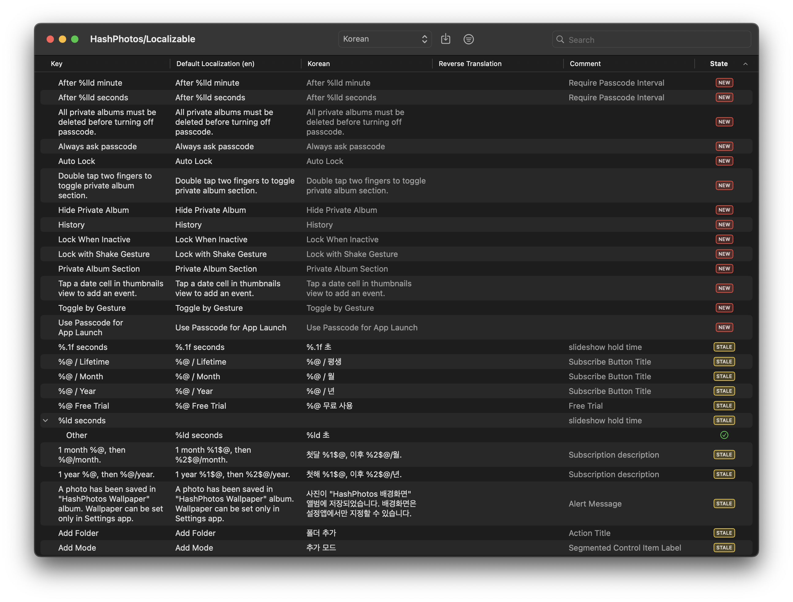

# XCStringsEditor

XCStringsEditor is an **editor** built with pure SwiftUI that can edit the **.xcstrings** localization file introduced in Xcode 15.

## Requirements

- macOS 14.0+
- Xcode 15.2+

## Features

- Open, edit translation and save .xcstrings file.
- Support plural variations. Plural variation should be added in Xcode before editing in XCStringsEditor.
- Support device variations. Device variation should be added in Xcode before editing in XCStringsEditor.
- Translate with Google Translate.
  Google Translate API Key must be set to use Auto Translate.
- Reverse Translation.
  You can check the translation with reverse translation.
- Filtering 
  New, Translated, Modified, Needs Review, Needs Work, Translate Later, Source=Translation
- Flag "Needs Work" or "Translate Later".
- Show/Hide "Needs Work" and "Translate Later" flagged items.

## Plans
- [ ] Open with .xcodeproj file.
- [ ] Add/Remove plural variations.
- [ ] Add/Remove device variations.
- [ ] Support multiple files.

 
## License

XCStringsEditor is available under the MIT license. See the LICENSE file for more info.

## Acknowledgements

Pencil image on Icon: Image by xvector on Freepik
